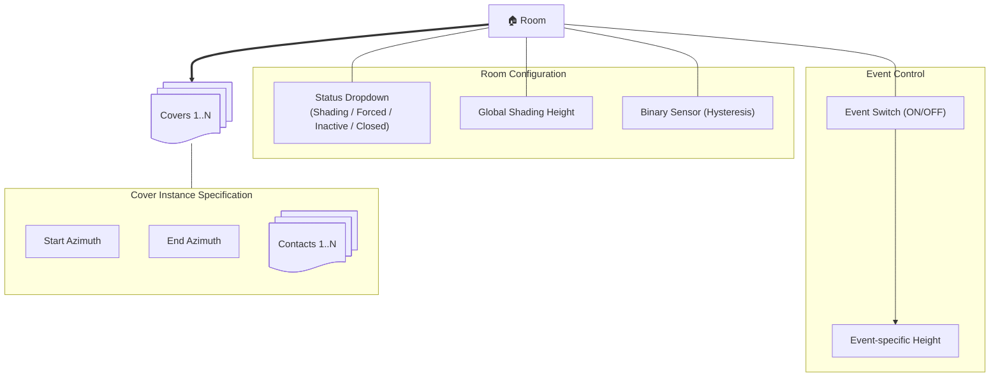

# Cover Control Advanced

[![HACS Custom][hacs-badge]][hacs-url]
[![Validate][validate-badge]][validate-url]

A Home Assistant custom integration for automated cover/shutter control – configurable via the UI, no YAML automations required.

## Features

- One config entry per cover
- Full shading logic in Python:
  - Night/day shading with configurable positions
  - Window/door contact detection (multiple sensors per cover)
  - Sun-position based shading via configured sun azimuth range (start/end degrees)
  - Event-switch controlled shading events
  - Cinema/event handling via a shared event switch
  - Sleep and closed mode
  - Shading hysteresis with 4-minute off-delay
- Diagnostic sensor per cover showing the last decision reason

## Installation via HACS

1. HACS → Integrations → ⋮ → Custom Repositories
2. URL: `https://github.com/revilo91/CoverControlAdvanced`
3. Category: `Integration`
4. Add repository, then install

## Manual Installation

```bash
cp -r custom_components/covercontroladvanced \
  /config/custom_components/covercontroladvanced
```

Restart HA.

## Configuration

**Settings → Integrations → + Add → Cover Control**

| Field | Required | Description |
|---|---|---|
| Cover entity | ✅ | The `cover.*` entity to control |
| Window/door contacts | – | Multiple `binary_sensor.*` supported |
| Sun azimuth start | ✅ | `0..359` degrees |
| Sun azimuth end | ✅ | `0..359` degrees (`start > end` wraps over `0°`) |
| Room automation | ✅ | `input_select.*` with values like `Automatic`, `Forced`, `Inactive`, `Manual`, `Sleep`, `Closed` |
| Shading hysteresis | ✅ | `binary_sensor.shading_hysteresis` |
| Day/night mode | ✅ | `input_boolean.day_night_mode` |
| Shading height | ✅ | `input_number.*` used as the single target position |
| Event switch | – | `switch.*` used as the shared trigger for shading events |

## Decision Logic (Priority)

```
1. Night + window open             → Shading height
2. Door open (no window sensor)    → Open
3. Night + event switch active     → Shading height
4. Night + closed                  → Close
5. Cinema event switch active      → Close
6. Day + sleep mode                → Shading height
7. Room = closed                   → Close
8. Day + shading + sun on side     → Shading height
9. Default                         → Day: Open / Night: Close
```
# System Architecture:

This document describes the hierarchical structure and logical dependencies of the entities for automated roller shutter and blind control (cover control) at the room level.

## 1. Visual Architecture


## Diagnostic Sensor

Each instance creates a diagnostic sensor for the configured cover and exposes the last decision reason as its `state`.

[hacs-badge]: https://img.shields.io/badge/HACS-Custom-orange.svg
[hacs-url]: https://hacs.xyz
[validate-badge]: https://github.com/revilo91/CoverControlAdvanced/actions/workflows/validate.yml/badge.svg
[validate-url]: https://github.com/revilo91/CoverControlAdvanced/actions/workflows/validate.yml
